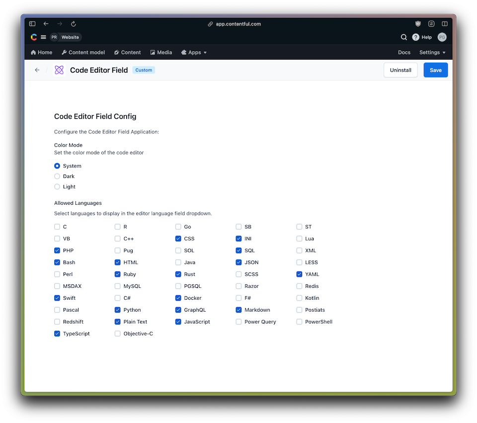
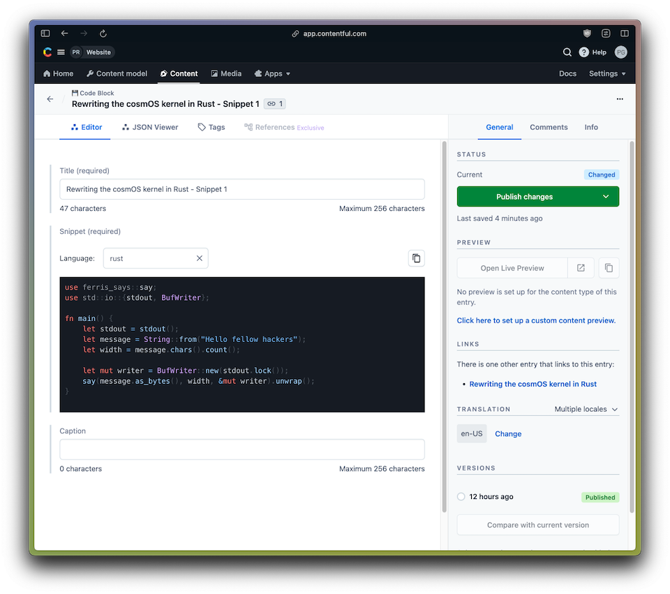

# Contentful Code Editor Field

A small Contentful App that utilizes the [React Textarea Code Editor](https://github.com/uiwjs/react-textarea-code-editor) to provide a simple but convenient code editor for storing code snippets in your content.

## ▶️ Demo

https://github.com/pauloamgomes/Contentful-Code-Editor-Field-App/assets/102261/f4cc1800-2b90-4e67-9382-60313bf3f401

## 🛠 Setup

Install the App by doing the below steps:

1. Create a new Contentful custom App and define the Application Name (e.g. Code Editor)

2. Download, extract [bundle.zip](https://github.com/pauloamgomes/contentful-code-editor-field-app/releases/download/v1.0.0/bundle.zip) and drag the resulting folder into the Bundles upload zone.
You can find more details about hosting an [Contentful app here](https://www.contentful.com/developers/docs/extensibility/app-framework/hosting-an-app/)

3. Set the App configuration screen and Field locations (JSON Object field).

4. Save, and Install the App in your space, you'll see the configuration screen:

6. Go to the Content Model you want to use the Code Editor, create a new JSON Object field and select the App in the Appearance tab.

7. Open or create a new entry of that Content Model and see it in action

## 🥷 Development

Clone this Repo and install dependencies `pnpm install`

In the project directory, you can run:

#### `pnpm run start`

Creates or updates your app definition in Contentful, and runs the app in development mode.
Open your app to view it in the browser.

The page will reload if you make edits.
You will also see any lint errors in the console.

#### `pnpm run build`

Builds the app for production to the `dist` folder.
It correctly bundles React in production mode and optimizes the build for the best performance.

The build is minified and the filenames include the hashes.
Your app is ready to be deployed!

#### `pnpm run upload`

Uploads the `dist` folder to Contentful and creates a bundle that is automatically activated.
The command guides you through the deployment process and asks for all required arguments.
Read [here](https://www.contentful.com/developers/docs/extensibility/app-framework/create-contentful-app/#deploy-with-contentful) for more information about the deployment process.

#### `pnpm run upload-ci`

Similar to `npm run upload` it will upload your app to contentful and activate it. The only difference is
that with this command all required arguments are read from the environment variables, for example when you add
the upload command to your CI pipeline.

For this command to work, the following environment variables must be set:

- `CONTENTFUL_ORG_ID` - The ID of your organization
- `CONTENTFUL_APP_DEF_ID` - The ID of the app to which to add the bundle
- `CONTENTFUL_ACCESS_TOKEN` - A personal [access token](https://www.contentful.com/developers/docs/references/content-management-api/#/reference/personal-access-tokens)

## Learn More

This project was bootstrapped with [Create Contentful App](https://github.com/contentful/create-contentful-app) using the vite-react example, and using pnpm as package manager.

## Copyright and license

Copyright 2023 pauloamgomes under the MIT license.
